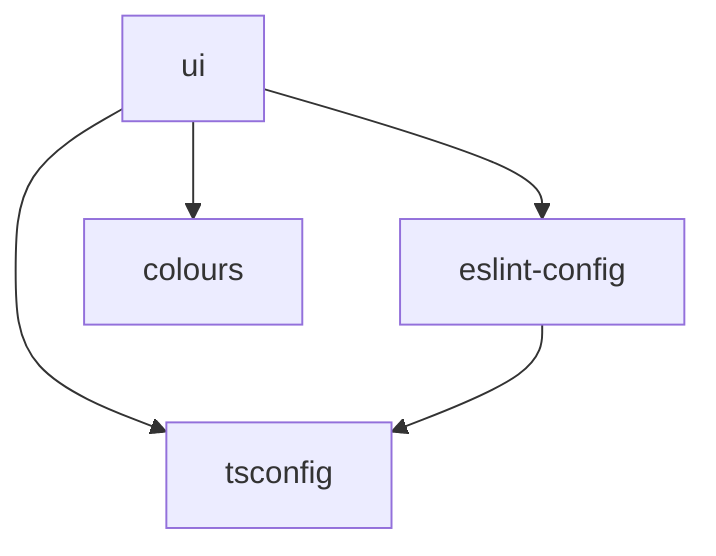

# Architecture

This document provides an overview of the Protomolecule monorepo architecture and design decisions.

## Tech Stack

### Core Technologies

- **Monorepo Management**: [Turborepo](https://turbo.build/) - High-performance build system for JavaScript and TypeScript codebases
- **Package Manager**: [pnpm](https://pnpm.io/) v10.15.0 - Fast, disk space efficient package manager with workspace support
- **Framework**: [React 19](https://react.dev/) - Latest React with automatic JSX runtime
- **Language**: [TypeScript 5](https://www.typescriptlang.org/) - Type-safe JavaScript with latest features
- **Styling**: [Tailwind CSS v4](https://tailwindcss.com/) - Utility-first CSS framework with CSS-based configuration
- **Component Development**: [Storybook v9](https://storybook.js.org/) - Tool for building UI components in isolation

### Quality & Testing

- **Testing Framework**: [Vitest](https://vitest.dev/) - Blazing fast unit test framework with happy-dom environment
- **Linting**: [ESLint v9](https://eslint.org/) - Modern flat config with TypeScript support
- **Formatting**: [Prettier](https://prettier.io/) - Opinionated code formatter
- **Git Hooks**: [Husky](https://typicode.github.io/husky/) with [lint-staged](https://github.com/okonet/lint-staged) - Automated pre-commit checks

### CI/CD & Publishing

- **Versioning**: [Changesets](https://github.com/changesets/changesets) - Version management and changelog generation
- **CI/CD**: GitHub Actions - Automated testing, building, and publishing
- **Registry**: NPM - Package publishing destination

## Project Structure

```text
protomolecule/
├── .github/               # GitHub configuration
│   └── workflows/         # CI/CD workflows
├── .husky/                # Git hooks configuration
├── docs/                  # Documentation
│   ├── architecture.md    # This file
│   ├── contributing.md    # Contribution guidelines
│   ├── development.md     # Development guide
│   ├── quick-start.md     # Getting started
│   └── release-process.md # Release documentation
├── packages/              # Monorepo packages
│   ├── ui/                # React component library
│   ├── eslint-config/     # Shared ESLint configuration
│   ├── tsconfig/          # Shared TypeScript configurations
│   ├── colours/           # Radix UI colour system
│   └── github-rulesets/   # GitHub repository configuration
├── CLAUDE.md              # AI assistant guidance
├── LICENSE                # MIT license
├── README.md              # Main documentation
├── package.json           # Root package configuration
├── pnpm-workspace.yaml    # Workspace configuration
└── turbo.json             # Turborepo configuration
```

## Package Architecture

### Package Types

1. **Published Packages** (NPM)
   - `@robeasthope/ui` - React component library
   - `@robeasthope/eslint-config` - ESLint configuration
   - `@robeasthope/colours` - Radix UI colour system

2. **Private Packages** (Internal)
   - `@robeasthope/tsconfig` - TypeScript configurations
   - `@robeasthope/github-rulesets` - GitHub configuration

### Package Dependencies



## Component Architecture

### Component Structure

Each component in the UI package follows a consistent structure:

```text
src/components/ComponentName/
├── index.ts                 # Public exports
├── ComponentName.tsx         # React component
├── ComponentName.test.tsx    # Unit tests
├── ComponentName.stories.ts  # Storybook stories
├── ComponentName.schema.ts   # Sanity CMS schema (if applicable)
└── ComponentName.query.ts    # GROQ queries (if applicable)
```

### Design Patterns

#### 1. Polymorphic Components

Components use the `as` prop pattern for flexible HTML element rendering:

```typescript
interface BoxProps<T extends React.ElementType = "div"> {
  as?: T;
  // other props
}
```

#### 2. ForwardRef Pattern

All components that need DOM access use React's forwardRef:

```typescript
export const Component = React.forwardRef<HTMLDivElement, ComponentProps>(
  (props, ref) => {
    // component implementation
  },
);
```

#### 3. Multi-Framework Support

Components are designed to work with different routing solutions:

- `NextInternalLink` - Next.js routing integration
- `ReactRouterLink` - React Router integration
- `OmniLink` - Framework-agnostic link component

#### 4. Sanity CMS Integration

Components that integrate with Sanity include:

- Schema definitions for content modelling
- GROQ queries for data fetching
- Portable Text components for rich text rendering

## Build Pipeline

### Development Build

```bash
pnpm dev
# Runs Storybook in development mode
# Hot module replacement enabled
# TypeScript checking in IDE
```

### Production Build

```bash
pnpm build
# 1. TypeScript compilation for all packages
# 2. Type checking across packages
# 3. Declaration file generation
# 4. Source map generation
```

### Testing Pipeline

```bash
pnpm test
# 1. Vitest runs all test files
# 2. Happy-dom provides browser environment
# 3. Coverage reports generated
```

## Styling Architecture

### Tailwind CSS v4

The project uses Tailwind CSS v4 with CSS-based configuration:

- Configuration in `packages/ui/tailwind.config.ts`
- Custom colour system from `@robeasthope/colours`
- Utility-first approach with component composition
- Dark mode support via CSS custom properties

### Colour System

Radix UI colours provide:

- 12-step colour scales
- Automatic dark mode variants
- Alpha transparency variants
- Semantic colour naming

## TypeScript Configuration

### Path Aliasing

All packages support the `@/` alias:

```typescript
// Instead of: import { something } from '../../../utils'
import { something } from "@/utils";
```

### Configuration Hierarchy

```text
@robeasthope/tsconfig/base.json
├── @robeasthope/tsconfig/react.json    (for UI package)
├── @robeasthope/tsconfig/node.json     (for Node packages)
└── @robeasthope/tsconfig/library.json  (for published libraries)
```

## Testing Strategy

### Unit Testing

- Components tested with Vitest and Testing Library
- Co-located test files for easy maintenance
- Happy-dom for fast browser environment simulation

### Integration Testing

- Storybook stories serve as integration tests
- Visual regression testing possible with Storybook
- Component interaction testing

### CI Testing

- All tests run on every pull request
- Type checking across all packages
- Linting and formatting checks

## Performance Considerations

### Build Performance

- Turborepo caches build outputs
- Parallel task execution
- Incremental builds

### Runtime Performance

- Tree-shaking enabled for production builds
- Code splitting support in applications
- Lazy loading for components

### Development Performance

- Fast refresh in Storybook
- Optimised TypeScript checking
- Efficient file watching

## Security

### Dependency Management

- Regular dependency updates
- Security audit via `pnpm audit`
- Automated Dependabot alerts

### Code Security

- TypeScript strict mode enabled
- ESLint security rules
- No secrets in repository

### CI/CD Security

- Protected main branch
- Required status checks
- Signed commits recommended

## Future Considerations

### Potential Enhancements

1. **Testing**: Add E2E testing with Playwright
2. **Documentation**: Automated API documentation generation
3. **Performance**: Bundle size analysis and optimisation
4. **Accessibility**: Enhanced ARIA support and testing
5. **Internationalisation**: i18n support for components

### Scalability

The monorepo structure supports:

- Adding new packages easily
- Sharing code between packages
- Independent package versioning
- Gradual migration strategies
