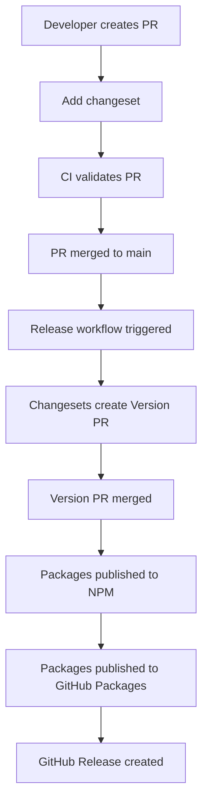

# Release Process

This document describes the automated release process for Protomolecule packages.

## Overview

Protomolecule uses a fully automated continuous deployment pipeline:

- **Changesets** for version management
- **GitHub Actions** for CI/CD
- **NPM** for primary package publishing
- **GitHub Packages** for secondary package publishing
- **Semantic versioning** for version numbers

## Automated Release Flow



## For Contributors

### 1. Creating Changesets

Every PR that modifies packages must include a changeset:

```bash
# Run the changeset CLI
pnpm changeset
```

The CLI will guide you through:

1. **Select packages** - Choose which packages you've modified
2. **Choose version bump**:
   - `patch` - Bug fixes, dependency updates
   - `minor` - New features (backward compatible)
   - `major` - Breaking changes
3. **Write summary** - Brief description for the changelog

#### Changeset File Example

`.changeset/brave-dragons-sing.md`:

```markdown
---
"@protomolecule/ui": minor
"@protomolecule/colours": patch
---

feat(ui): add new Alert component with customisable variants

fix(colours): correct amber colour scale in dark mode
```

### 2. Version Bump Guidelines

#### Patch Release (x.x.1)

- Bug fixes
- Performance improvements
- Dependency updates (non-breaking)
- Documentation fixes in code

```bash
# Example changeset for patch
---
"@protomolecule/eslint-config": patch
---

fix: resolve incorrect TypeScript rule configuration
```

#### Minor Release (x.1.0)

- New features
- New components
- New utilities
- Backward-compatible API additions

```bash
# Example changeset for minor
---
"@protomolecule/ui": minor
---

feat: add new DataTable component with sorting and filtering
```

#### Major Release (1.0.0)

- Breaking API changes
- Significant refactors
- Dependency major updates
- Removal of deprecated features

```bash
# Example changeset for major
---
"@protomolecule/ui": major
---

feat!: redesign Button component API for better composability

BREAKING CHANGE: Button now uses 'variant' prop instead of 'type'
```

### 3. Multiple Package Changes

When changing multiple packages:

```markdown
---
"@protomolecule/ui": minor
"@protomolecule/eslint-config": patch
"@protomolecule/tsconfig": patch
---

feat(ui): add TypeScript 5.3 features support

Updates TypeScript configuration and ESLint rules to support new TS features
```

## For Maintainers

### Release Workflow

The release process is triggered automatically when changes are merged to `main`:

1. **Version PR Creation**
   - Changesets bot creates a PR titled "Version Packages"
   - PR includes:
     - Updated package versions
     - Updated changelogs
     - Updated dependencies

2. **Review Version PR**
   - Check version bumps are correct
   - Review changelog entries
   - Ensure no breaking changes are missed

3. **Merge Version PR**
   - Merging triggers the release
   - No manual intervention needed

4. **Automatic Publishing**
   - Packages built and tested
   - Published to NPM registry
   - Published to GitHub Packages registry
   - GitHub Release created
   - Announcement posted

### Manual Release (Emergency)

In rare cases, you may need to release manually:

```bash
# 1. Ensure you're on main and up to date
git checkout main
git pull origin main

# 2. Run changesets version
pnpm changeset version

# 3. Commit version changes
git add .
git commit -m "chore: version packages"

# 4. Build all packages
pnpm build

# 5. Publish to NPM
pnpm changeset publish

# 6. Push tags
git push --follow-tags
```

### Pre-releases

For testing major changes:

```bash
# 1. Enter pre-release mode
pnpm changeset pre enter beta

# 2. Create changesets as normal
pnpm changeset

# 3. Version packages
pnpm changeset version

# 4. Publish pre-release
pnpm changeset publish

# 5. Exit pre-release mode
pnpm changeset pre exit
```

Pre-release versions look like: `2.0.0-beta.0`

## Published Packages

The following packages are published to both NPM and GitHub Packages:

| Package                        | NPM                                                                                                                                 | Description             |
| ------------------------------ | ----------------------------------------------------------------------------------------------------------------------------------- | ----------------------- |
| `@protomolecule/ui`            | [](https://www.npmjs.com/package/@protomolecule/ui)                       | React component library |
| `@protomolecule/eslint-config` | [](https://www.npmjs.com/package/@protomolecule/eslint-config) | ESLint configuration    |
| `@protomolecule/colours`       | [](https://www.npmjs.com/package/@protomolecule/colours)             | Radix UI colour system  |

### Installing from Different Registries

**From NPM (default):**

```bash
npm install @protomolecule/ui
```

**From GitHub Packages:**

```bash
# Configure npm to use GitHub Packages for @protomolecule scope
echo "@protomolecule:registry=https://npm.pkg.github.com" >> .npmrc
npm install @protomolecule/ui
```

Private packages (`@protomolecule/tsconfig`, `@protomolecule/github-rulesets`) are versioned but not published.

## GitHub Actions Workflows

### CI Workflow (`.github/workflows/linting-and-testing.yml`)

Runs on every PR:

- Install dependencies
- Run linting
- Run tests
- Type checking
- Build packages
- Verify changeset exists

### Release Workflow (`.github/workflows/release.yml`)

Runs on push to `main`:

- Creates Version PR via Changesets
- On Version PR merge:
  - Publishes to NPM
  - Publishes to GitHub Packages
  - Creates GitHub Release
  - Posts release summary

## Changelog Management

### Automatic Changelog Generation

Changesets automatically update `CHANGELOG.md` files:

```markdown
# @protomolecule/ui

## 2.1.0

### Minor Changes

- abc1234: Add new Alert component with customisable variants

### Patch Changes

- def5678: Fix Button hover state in dark mode
- Updated dependencies
  - @protomolecule/colours@2.0.1
```

### Changelog Best Practices

Write changesets that are:

- **User-focused** - Describe what users gain
- **Clear** - Avoid technical jargon
- **Actionable** - Help users understand impact

Good examples:

- ✅ "Add loading state to Button component"
- ✅ "Fix memory leak in useEffect cleanup"
- ✅ "Improve TypeScript types for better IDE support"

Bad examples:

- ❌ "Update stuff"
- ❌ "Fix bug"
- ❌ "Refactor code"

## Version Strategy

### Package Versioning

- All packages start at `1.0.0`
- Independent versioning per package
- Follow semantic versioning strictly

### Dependency Updates

When updating dependencies between packages:

```json
{
  "dependencies": {
    "@protomolecule/colours": "workspace:^"
  }
}
```

The `workspace:^` protocol ensures:

- Local development uses workspace version
- Published packages use actual version

### Breaking Change Strategy

1. **Deprecate first** (when possible)

   ```typescript
   /** @deprecated Use 'variant' prop instead */
   type?: 'primary' | 'secondary';
   ```

2. **Document migration**

   ````markdown
   ## Migration Guide

   ### Button Component

   ```diff
   - <Button type="primary">
   + <Button variant="primary">
   ```
   ````

3. **Release as major version**

   ```markdown
   ---
   "@protomolecule/ui": major
   ---

   BREAKING CHANGE: Button 'type' prop renamed to 'variant'
   ```

## Troubleshooting Releases

### Common Issues

#### Changeset Check Failing

```bash
# Error: No changeset found
# Solution: Add a changeset
pnpm changeset
```

#### NPM Publish Failing

```bash
# Error: 402 Payment Required
# Solution: Check NPM account and permissions

# Error: Version already exists
# Solution: Changesets may be out of sync
pnpm changeset version
```

#### GitHub Release Not Created

- Check GitHub Actions logs
- Ensure `GITHUB_TOKEN` has correct permissions
- Verify workflow file is correct

### Recovery Procedures

#### Failed Partial Release

If some packages published but others failed:

1. Check which packages published:

   ```bash
   npm view @protomolecule/ui version
   ```

2. Manually publish failed packages:

   ```bash
   cd packages/failed-package
   npm publish
   ```

3. Create GitHub Release manually

#### Reverting a Bad Release

1. **Deprecate bad version**:

   ```bash
   npm deprecate @protomolecule/ui@2.0.0 "Contains critical bug"
   ```

2. **Publish patch fix**:

   ```bash
   # Create fix
   # Add changeset
   # Merge and release
   ```

3. **Document in release notes**

## Security Considerations

### NPM Token Security

- Token stored in GitHub Secrets
- Scoped to organisation
- Rotated regularly
- Publish-only permissions

### Package Integrity

- All packages signed
- Lock files committed
- Dependency audits in CI
- Automated security updates

## Release Notifications

Releases are announced via:

- GitHub Releases page
- NPM registry updates
- Git tags
- Changelog files

Users can watch the repository for release notifications.

## Best Practices

### For Contributors

1. **One changeset per PR** (usually)
2. **Clear changeset summaries**
3. **Include breaking change notes**
4. **Test thoroughly before merging**

### For Maintainers

1. **Review Version PRs carefully**
2. **Batch releases when sensible**
3. **Document breaking changes clearly**
4. **Monitor release pipeline**
5. **Respond quickly to failed releases**

## Troubleshooting

### Common Issues

- **GitHub Packages 403 errors**: See [Manual Publishing Guide](./GITHUB_PACKAGES_MANUAL_PUBLISH.md)
- **Token permission issues**: See [RELEASE_PAT Setup](./RELEASE_PAT_SETUP.md)
- **First-time publishing**: Follow the [Manual Publishing Guide](./GITHUB_PACKAGES_MANUAL_PUBLISH.md)

## Future Improvements

Planned enhancements:

- Canary releases for testing
- Automated dependency updates
- Release previews in PRs
- Slack/Discord notifications
- Package download statistics dashboard

## Related Documentation

- [RELEASE_PAT Setup Guide](./RELEASE_PAT_SETUP.md) - Configure your Personal Access Token
- [Manual GitHub Packages Publishing](./GITHUB_PACKAGES_MANUAL_PUBLISH.md) - Manual publishing instructions
- [Contributing Guide](./contributing.md) - How to contribute to the project
- [Development Guide](./development.md) - Local development setup
